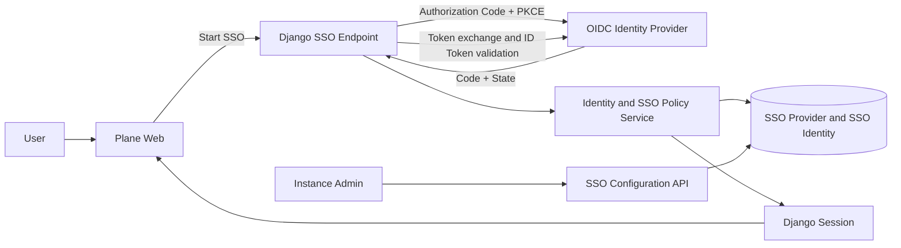

# SSO Authentication Improvement Plan

## 1. Objective

เพิ่ม Single Sign-On (SSO) ให้ Plane Community Edition โดยเริ่มจาก Generic OpenID Connect (OIDC) ระดับ instance ซึ่งใช้ร่วมกับ Microsoft Entra ID, Okta, Keycloak, Auth0 และ Google Workspace ได้ แล้วจึงเพิ่ม SAML 2.0 ในระยะถัดไปเมื่อมี use case ที่ OIDC รองรับไม่ได้

เป้าหมายของงานนี้คือ:

- ให้ผู้ดูแล instance ตั้งค่าและทดสอบ Identity Provider (IdP) จาก Admin UI ได้
- ให้ผู้ใช้เข้าสู่ระบบผ่าน SSO และกลับมาใช้ Django session เดิมของ Plane
- รองรับ Just-in-Time (JIT) provisioning ภายใต้ policy ที่ผู้ดูแลกำหนด
- รองรับการบังคับใช้ SSO โดยไม่ทำให้ผู้ดูแลระบบถูกล็อกออกจาก instance
- สร้างฐานข้อมูลและ abstraction ที่รองรับหลาย IdP และ SAML ในอนาคต

## 2. Scope and assumptions

แผนนี้ใช้สมมติฐานต่อไปนี้:

- SSO policy มีผลระดับ instance เพราะ `User` และ authentication configuration ปัจจุบันเป็น global ต่อ instance
- ระยะแรกเปิดใช้งาน IdP ได้หนึ่งตัว แต่ schema ต้องรองรับหลาย provider เพื่อไม่สร้างข้อจำกัดถาวร
- OIDC Authorization Code Flow เป็น protocol หลัก
- Django session cookie ยังคงเป็นกลไก authentication ภายใน Plane หลัง SSO callback สำเร็จ
- SSO ใช้กับแอปหลัก (`apps/web`) ก่อน ส่วน `apps/space` ต้องเปิดใช้เมื่อ private Space ต้องอาศัย login policy เดียวกัน
- Admin authentication ต้องมี recovery path แยกจาก enforced SSO
- SCIM provisioning และการ map group ไปยัง workspace/project role อยู่นอก MVP

### Delivery governance

- `bmad-orchestrator` owns workflow routing, readiness checks, gate decisions, and state updates through delivery completion.
- The user delegates approval authority for planning, architecture, story completion, and delivery gates to `bmad-orchestrator` on 2026-09-10.
- A gate passes only when its documented entry and exit criteria have objective repository evidence; the orchestrator must record the decision, evidence, validation results, deviations, and unresolved risks.
- The orchestrator must route security-sensitive design readiness through `bmad:gate-check`, implementation through story workflows, and completed changes through code review and test evidence before accepting delivery.
- Failed criteria remain open work. The orchestrator may revise, split, or reject stories and repeat validation without seeking routine approval.

Plane logout terminates the local session and records an audit event. The first release does not retain ID tokens solely for front-channel IdP logout; administrators should configure an IdP session lifetime appropriate for shared devices.

- Human escalation remains mandatory for production deployment, credentials or payment handling, spending money, deletion of user data, external communications, or a product decision that materially expands or contradicts this contract.
- Automated approval authority does not permit lowering security requirements, omitting required tests, accepting known critical/high-severity findings, or marking incomplete work complete.

## 3. Current-state review

### 3.1 System architecture

โครงการเป็น monorepo ประกอบด้วย:

- `apps/web` — React Router application สำหรับ Plane workspace
- `apps/admin` — React Router application สำหรับ instance administration หรือ God Mode
- `apps/space` — application สำหรับ shared/public Space
- `apps/api` — Django 5.2 และ Django REST Framework backend
- `packages/services` — client-side API services
- `packages/shared-state` — MobX stores
- `packages/types` — shared TypeScript contracts
- `packages/ui` — reusable UI components

### 3.2 Existing authentication

ระบบปัจจุบันรองรับ:

- Email/password
- Magic code ทางอีเมล
- Google OAuth
- GitHub OAuth
- GitLab OAuth
- Gitea OAuth
- Django server-side session พร้อม HttpOnly cookie
- Admin UI สำหรับเปิด ปิด และตั้งค่า authentication provider
- การเข้ารหัส provider client secrets ใน `InstanceConfiguration`

OAuth callback ตรวจ `state` แล้วส่งผู้ใช้เข้า `Adapter.complete_login_or_signup()` ก่อนสร้าง Django session ด้วย `user_login()` โครงสร้างนี้นำ session creation, safe redirect และ post-auth workflow มาใช้กับ SSO ได้

### 3.3 Existing extension points

- Backend มี `Adapter` และ `OauthAdapter` เป็นฐานของ provider
- `apps/web/core/hooks/oauth/extended.tsx` เป็น extension hook แต่ยังคืนค่าเปล่า
- Admin รวม authentication methods ผ่าน `apps/admin/hooks/oauth/index.ts`
- Public instance endpoint ส่ง authentication flags ให้หน้า sign-in
- `InstanceConfiguration` รองรับ encrypted values สำหรับ client secrets

### 3.4 Gaps and risks

#### No functional generic SSO implementation

ข้อความ OIDC/SAML และ SSO มีอยู่ใน translations และ subscription descriptions แต่ source ชุดนี้ไม่มี OIDC/SAML provider, route, identity model หรือ Admin configuration ที่ใช้งานจริง

#### Identity model is insufficient for OIDC

`Account` ระบุตัวตนด้วย `provider` และ `provider_account_id` แต่ OIDC subject (`sub`) unique เฉพาะภายใน issuer ดังนั้น identity ที่ถูกต้องต้องใช้ `(issuer, subject)` หรือ `(sso_provider_id, subject)`

#### Existing OAuth flow is not an OIDC validator

`OauthAdapter` แลก access token และอ่าน UserInfo แต่ไม่ได้ตรวจ OIDC ID Token claims ครบถ้วน เช่น signature, `iss`, `aud`, `azp`, `exp`, `iat` และ `nonce` จึงไม่ควรเพิ่ม OIDC ด้วยการเปลี่ยน URL ของ adapter เดิมเพียงอย่างเดียว

#### Email-first account matching is unsafe for generic SSO

Flow ปัจจุบันค้นหา `User` ด้วย email ก่อน สำหรับ SSO ต้องค้นหา identity ด้วย `(provider, subject)` ก่อน การ link ด้วย email อนุญาตได้เฉพาะเมื่อ IdP ส่ง `email_verified=true` และ policy อนุญาตอย่างชัดเจน

#### Tokens are retained unnecessarily

`Account` เก็บ access token, refresh token และ ID token การเข้าสู่ระบบด้วย SSO ไม่จำเป็นต้องเก็บ token หาก Plane ไม่ได้ใช้ token เรียก IdP API หลัง login การไม่เก็บ token ช่วยลดผลกระทบเมื่อฐานข้อมูลรั่วไหล

#### OAuth expiry calculation needs correction

Google provider นำ `expires_in` ซึ่งเป็นจำนวนวินาที ไปใช้เป็น Unix timestamp โดยตรง ค่าที่ถูกต้องต้องคำนวณจากเวลาปัจจุบัน เช่น `timezone.now() + timedelta(seconds=expires_in)` และควรตรวจ provider อื่นด้วย

#### Secrets are returned as plaintext to Admin API clients

`InstanceConfigurationSerializer` decrypts encrypted values ก่อนส่งกลับ แม้ endpoint จำกัดเฉพาะ instance admin แต่ SSO configuration ควรส่งค่า secret แบบ masked และใช้ write-only update เพื่อลดการเปิดเผย secret ผ่าน browser, proxy และ diagnostics

#### Test coverage is incomplete

Authentication tests ปัจจุบันครอบคลุม password, magic code, API key และ session เป็นหลัก แต่ยังไม่มี contract tests สำหรับ OAuth/OIDC callback validation, replay protection, JWKS rotation และ identity collision

## 4. Target architecture

### 4.1 Domain model

เพิ่ม `SSOProvider`:

- `id`
- `name`
- `slug`
- `protocol` (`oidc` หรือ `saml`)
- `issuer_url`
- `client_id`
- encrypted `client_secret`
- `scopes`
- `claim_mappings`
- `allowed_email_domains`
- `allowed_groups`
- `jit_provisioning_enabled`
- `enabled`
- `enforced`
- `configuration_tested_at`
- `created_at`, `updated_at`

เพิ่ม `SSOIdentity`:

- `id`
- `provider` foreign key
- `user` foreign key
- `subject`
- safe identity metadata
- `last_login_at`
- `created_at`, `updated_at`
- unique constraint `(provider, subject)`

ไม่ควรบันทึก raw ID token, access token หรือ refresh token ใน `SSOIdentity` สำหรับ authentication-only flow

### 4.2 Identity resolution

Callback ต้อง resolve ผู้ใช้ตามลำดับนี้:

1. ตรวจ protocol response และ claims ทั้งหมดให้สำเร็จ
2. ค้นหา `SSOIdentity` ด้วย provider และ `sub`
3. ถ้าพบ identity ให้ใช้ user ที่เชื่อมอยู่ แม้อีเมลจาก IdP เปลี่ยน
4. ถ้าไม่พบ ให้พิจารณา link กับ user เดิมเฉพาะเมื่อ `email_verified=true` และ auto-link policy เปิดอยู่
5. ถ้ายังไม่พบและ JIT เปิด ให้ตรวจ allowed domain/group แล้วสร้าง user และ identity ใน transaction เดียวกัน
6. ถ้า JIT ปิดหรือ policy ไม่ผ่าน ให้ปฏิเสธ login โดยไม่สร้างข้อมูลบางส่วน

การ link identity ต้องจัดการ race condition ด้วย database unique constraint และ atomic transaction

### 4.3 Endpoints

Authentication endpoints:

- `GET /auth/sso/<provider_slug>/`
- `GET /auth/sso/<provider_slug>/callback/`
- `POST /auth/sso/<provider_slug>/logout/` หรือใช้ sign-out เดิมร่วมกับ RP-initiated logout

Instance administration endpoints:

- `GET /api/instances/sso/providers/`
- `POST /api/instances/sso/providers/`
- `GET /api/instances/sso/providers/<id>/`
- `PATCH /api/instances/sso/providers/<id>/`
- `DELETE /api/instances/sso/providers/<id>/`
- `POST /api/instances/sso/providers/<id>/test/`

Admin endpoints ทุกตัวต้องใช้ `InstanceAdminPermission` และห้ามส่ง client secret กลับเป็น plaintext

## 5. Security requirements

### 5.1 OIDC protocol validation

ใช้ Authorization Code Flow พร้อม:

- PKCE `S256`
- transaction-specific `state`
- transaction-specific `nonce`
- exact redirect URI
- one-time transaction data ที่ผูกกับ browser session

Callback ต้องตรวจ:

- ID Token signature ผ่าน JWKS
- อนุญาตเฉพาะ signing algorithms ที่กำหนดไว้ ห้ามยอมรับ `none`
- `iss` ตรงกับ configured issuer แบบ exact match
- `aud` มี Plane client ID
- `azp` ถูกต้องเมื่อ token มีหลาย audience
- `exp`, `iat` และ `nbf` พร้อม clock skew ที่จำกัด
- `nonce` ตรงกับ transaction และยังไม่ถูกใช้
- `sub` มีค่า
- `email` มีรูปแบบถูกต้อง
- `email_verified` เป็น `true` ก่อนใช้ email เพื่อสร้างหรือ link account

Discovery metadata ต้องมาจาก HTTPS issuer, ตรวจว่า metadata `issuer` ตรงกับ configured issuer และจำกัด outbound requests เพื่อป้องกัน SSRF รวมถึง redirects ไป private/link-local addresses

แนวทางอ้างอิง:

- [OpenID Connect Core 1.0](https://openid.net/specs/openid-connect-core-1_0.html)
- [OpenID Connect Discovery 1.0](https://openid.net/specs/openid-connect-discovery-1_0.html)
- [OAuth 2.0 Security Best Current Practice, RFC 9700](https://www.rfc-editor.org/rfc/rfc9700.html)

### 5.2 Library selection

แนะนำใช้ Authlib เพื่อทำ discovery, token exchange และ ID Token/JWKS validation แทนการเขียน cryptographic validation เอง

ต้องใช้ Authlib `>=1.6.9` เนื่องจากเวอร์ชัน `<=1.6.8` ได้รับผลกระทบจากช่องโหว่ fail-open ใน OIDC hash validation ตาม [GHSA-m344-f55w-2m6j](https://github.com/authlib/authlib/security/advisories/GHSA-m344-f55w-2m6j)

ก่อน merge ต้องตรวจเวอร์ชันล่าสุดและ security advisories อีกครั้ง แล้ว pin เวอร์ชันใน `apps/api/requirements/base.txt`

### 5.3 Enforced SSO and recovery

- เปิด enforce ได้หลัง provider configuration test ผ่านเท่านั้น
- Backend ต้องปฏิเสธ password, magic code และ social OAuth endpoints สำหรับผู้ใช้ที่อยู่ภายใต้ enforced SSO ไม่ใช่เพียงซ่อนปุ่มใน UI
- ต้องมี break-glass admin account อย่างน้อยหนึ่งบัญชี
- Recovery route ต้องจำกัดเฉพาะ instance admin, มี rate limit, audit log และตั้งค่าได้ผ่าน deployment secret หรือ environment configuration
- ห้ามให้ผู้ดูแลปิด authentication method สุดท้ายที่ยังใช้งานได้
- Enforce action ควรแสดง callback URL, recovery procedure และผลการทดสอบ IdP ก่อนยืนยัน

### 5.4 Session and logout

- Rotate Django session key หลัง authentication สำเร็จ
- ลบ `state`, `nonce`, PKCE verifier และ next-path transaction data หลังใช้
- กำหนดอายุ SSO transaction สั้น เช่น 5–10 นาที
- ใช้ safe redirect utility เดิมกับ `next_path`
- Local logout ต้องยกเลิก Plane session เสมอ
- รองรับ RP-initiated logout เมื่อ discovery metadata มี `end_session_endpoint`
- ห้ามทำให้ IdP logout failure ขัดขวาง local logout

### 5.5 Logging and auditing

ห้าม log:

- Authorization code
- Access token
- Refresh token
- ID token
- Client secret
- Raw SAML assertion

เพิ่ม audit events:

- SSO provider created, updated, enabled, disabled และ deleted
- Configuration test success/failure
- Enforcement enabled/disabled
- Identity linked/unlinked
- SSO login success/failure พร้อม provider, error category และ request correlation ID

## 6. Delivery phases

### Phase 0 — Product and policy decisions

งาน:

- ยืนยัน IdP เป้าหมายสำหรับ compatibility testing
- ยืนยัน instance-wide scope
- กำหนด JIT provisioning และ auto-link policy
- กำหนด allowed email domains/groups
- กำหนด break-glass ownership และ recovery procedure
- ตัดสินใจว่า `apps/space` อยู่ใน MVP หรือ follow-up

ผลลัพธ์:

- Approved SSO policy
- Threat model
- Test IdP tenants สำหรับ Entra ID, Okta และ Keycloak

### Phase 1 — Authentication foundation

งาน:

- เพิ่ม `SSOProvider` และ `SSOIdentity` migrations
- เพิ่ม repository/service สำหรับ provider configuration และ identity resolution
- เพิ่ม encrypted secret handling แบบ write-only
- เพิ่ม structured authentication errors
- แก้ OAuth expiry calculation
- เพิ่ม regression tests ให้ OAuth adapter เดิม

ผลลัพธ์:

- Schema และ domain service พร้อมสำหรับ protocol adapter
- OAuth behavior เดิมไม่เปลี่ยน

### Phase 2 — Generic OIDC backend

งาน:

- เพิ่มและ pin OIDC client library
- ทำ discovery และ validate metadata
- ทำ authorization initiation ด้วย state, nonce และ PKCE
- ทำ callback และ ID Token validation
- ทำ identity linking และ JIT provisioning แบบ atomic
- เชื่อมกับ `post_user_auth_workflow()` และ `user_login()` เดิม
- เพิ่ม provider test endpoint
- เพิ่ม cache สำหรับ discovery/JWKS พร้อมรองรับ key rotation

ผลลัพธ์:

- OIDC login ทำงาน end-to-end ผ่าน API

### Phase 3 — Admin UI and shared contracts

งาน:

- เพิ่ม TypeScript types ใน `packages/types`
- เพิ่ม services ใน `packages/services`
- เพิ่ม MobX state เฉพาะเมื่อหน้าจอต้องแชร์ state หลายส่วน
- เพิ่ม SSO authentication card ใน Admin
- เพิ่ม create/edit/test provider form
- Mask secret และรองรับ secret rotation
- เพิ่ม JIT, domain/group, sync และ enforcement controls
- เพิ่ม Storybook stories สำหรับ reusable UI components

ผลลัพธ์:

- Instance admin ตั้งค่า ทดสอบ เปิดใช้ และปิดใช้ OIDC provider ได้

### Phase 4 — Sign-in UX and enforcement

งาน:

- เพิ่ม SSO option ใน `apps/web/core/hooks/oauth/extended.tsx` หรือ refactor ชื่อ hook ให้ครอบคลุม authentication providers
- เพิ่ม `is_sso_enabled` และข้อมูล provider ที่ปลอดภัยใน public instance response
- เพิ่ม “Continue with SSO” ใน auth form
- รองรับ provider selection หากมีหลาย provider
- บังคับ SSO ใน backend endpoints
- เพิ่ม recovery route สำหรับ instance admins
- ป้องกัน redirect loop เมื่อ IdP ล่มหรือ callback ล้มเหลว
- เพิ่มข้อความ error ที่ไม่เปิดเผยข้อมูล sensitive

ผลลัพธ์:

- ผู้ใช้เข้าสู่ระบบผ่าน SSO ได้จากหน้า sign-in
- Enforced SSO ไม่มี client-side หรือ direct-endpoint bypass

### Phase 5 — Logout, observability, hardening and rollout

งาน:

- เพิ่ม local logout และ RP-initiated logout
- เพิ่ม audit logs และ metrics
- เพิ่ม rate limiting สำหรับ initiation/callback errors
- ทดสอบ reverse proxy, HTTPS, cookie domain และ forwarded headers
- ทดสอบ JWKS rotation, expired certificates และ IdP outage
- ทำ staged rollout โดยเริ่มจาก optional SSO ก่อน enforced SSO
- เขียน operator runbook และ rollback procedure

ผลลัพธ์:

- ระบบพร้อมใช้งาน production และมีวิธีกู้คืนเมื่อ IdP ใช้งานไม่ได้

### Phase 6 — SAML 2.0 follow-up

เพิ่ม SAML เมื่อมี use case ที่ต้องรองรับ โดย reuse provider, identity, policy, audit และ session services เดิม

SAML adapter ต้องรองรับ:

- SP metadata และ Entity ID
- Assertion Consumer Service (ACS)
- IdP metadata URL หรือ metadata XML
- Certificate rotation
- Signed assertions/responses
- Validation ของ issuer, audience, recipient, validity window และ `InResponseTo`
- Replay prevention
- SAML Single Logout เป็น optional follow-up

อ้างอิง [SAML V2.0 Errata 05](https://docs.oasis-open.org/security/saml/v2.0/errata05/csd01/saml-v2.0-errata05-csd01.html)

## 7. Test plan

### Unit tests

- Provider configuration validation
- Issuer URL and discovery validation
- Claim validation and normalization
- Identity lookup by provider and subject
- Verified-email auto-link rules
- JIT domain/group policy
- Enforced SSO policy decisions
- Secret masking and update behavior
- Authentication error mapping

### Contract tests

- Initiation creates state, nonce and PKCE transaction
- Valid callback creates session
- Existing identity logs into the same Plane user
- Invalid state/nonce is rejected
- Expired or not-yet-valid token is rejected
- Wrong issuer/audience/authorized party is rejected
- Invalid signature and unknown algorithm are rejected
- Replayed callback is rejected
- Unverified email cannot create or auto-link an account
- JIT disabled does not create an account
- Disabled/deactivated/bot users cannot authenticate
- Enforced SSO blocks credential and social OAuth endpoints
- Break-glass admin remains usable
- Safe redirect rejects external next-path values

### Integration tests

- Entra ID
- Okta
- Keycloak
- JWKS key rotation
- Client secret rotation
- IdP timeout and malformed discovery response
- Reverse proxy deployment with HTTPS and configured cookie domain

### Frontend tests

- SSO button visibility from instance configuration
- Loading and error states
- Multiple provider selection
- Admin form validation
- Test connection feedback
- Enforcement confirmation and recovery warning
- Secret remains masked after save/reload

## 8. Acceptance criteria

- Entra ID, Okta และ Keycloak ใช้งานผ่าน generic OIDC provider ได้
- OIDC Authorization Code Flow ใช้ PKCE `S256`, `state` และ `nonce`
- Callback ที่ signature, issuer, audience, expiry หรือ nonce ไม่ถูกต้องถูกปฏิเสธ
- Authorization transaction และ callback replay ใช้ซ้ำไม่ได้
- ผู้ใช้เดิมถูก resolve ด้วย provider และ `sub` แม้อีเมลเปลี่ยน
- ไม่มีการ auto-link จาก unverified email
- JIT disabled ไม่สร้างผู้ใช้ใหม่
- Allowed domain/group policy ถูกบังคับใน backend
- Enforced SSO ข้ามผ่าน password, magic code หรือ social OAuth ไม่ได้
- Instance admin มี recovery path ที่ทดสอบแล้ว
- Client secret, authorization code และ tokens ไม่ปรากฏใน log หรือ API response
- Provider configuration สามารถ test ก่อน enable และ enforce
- Unit, contract และ integration tests ที่ระบุผ่านทั้งหมด
- `pnpm check` ผ่านสำหรับ frontend/shared packages ที่เปลี่ยน
- Django authentication test subset ผ่านใน Docker test stack
- `bmad-orchestrator` records a final delivery decision with requirement traceability, code-review results, test evidence, known limitations, and rollback instructions

## 9. Rollout and rollback

### Rollout

1. Deploy schema และ backend โดย provider ยัง disabled
2. ตั้งค่า provider และรัน connection test
3. เปิด optional SSO ให้กลุ่มผู้ทดสอบ
4. ตรวจ login success rate, error categories และ audit events
5. ทดสอบ break-glass account และ rollback procedure
6. เปิด JIT หรือ domain/group restrictions ตาม policy
7. เปิด enforced SSO ใน maintenance window
8. เฝ้าดู login failures และ session behavior หลัง rollout

### Rollback

- ปิด `enforced` โดยไม่ลบ provider หรือ identities
- เปิด password หรือ magic-code authentication ที่ผ่านการทดสอบแล้ว
- เก็บ SSO identity records ไว้เพื่อให้เปิดกลับได้โดยไม่ relink ผู้ใช้
- Rollback application version โดย migration ต้อง backward-compatible ในช่วง rollout
- ห้ามลบ provider/identity data เพื่อแก้ incident เว้นแต่มี backup และแผน recovery

## 10. Estimate

ประมาณการสำหรับวิศวกรหนึ่งคน โดยไม่รวมเวลารอ IdP tenant หรือ security review ภายนอก:

- Phase 0: 2–3 วันทำงาน
- Phase 1: 4–6 วันทำงาน
- Phase 2: 8–12 วันทำงาน
- Phase 3: 5–7 วันทำงาน
- Phase 4: 4–6 วันทำงาน
- Phase 5: 4–6 วันทำงาน
- SAML follow-up: เพิ่มประมาณ 10–15 วันทำงาน

OIDC ที่พร้อมใช้งาน production จึงอยู่ที่ประมาณ 27–40 วันทำงาน ขึ้นกับจำนวน IdP, enforcement policy, `apps/space` scope และความพร้อมของ integration test environments

## 11. Deferred work

รายการต่อไปนี้ควรแยกเป็นโครงการถัดไป:

- SCIM user and group provisioning
- Group-to-workspace/project role mapping
- Multiple active IdP routing ตาม email domain
- Account linking/unlinking self-service UI
- IdP-initiated logout และ back-channel logout
- Automated certificate/metadata rollover สำหรับ SAML
- Per-workspace SSO policy
